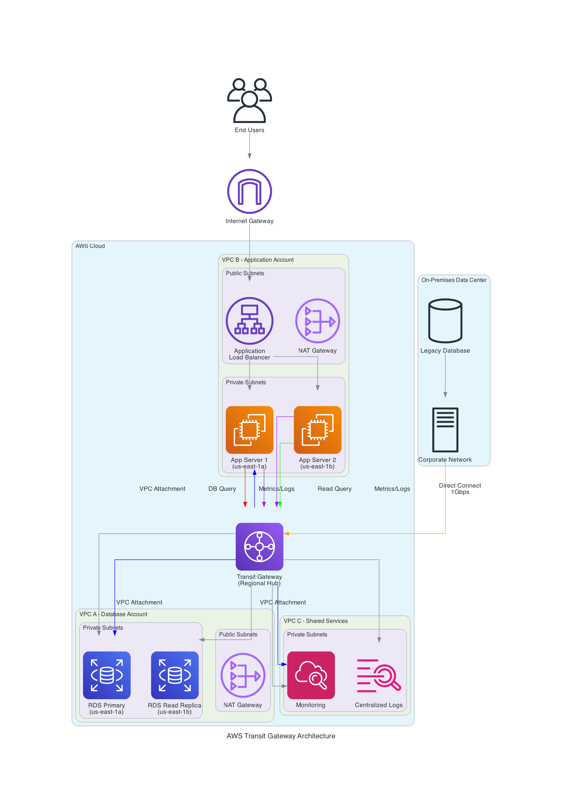
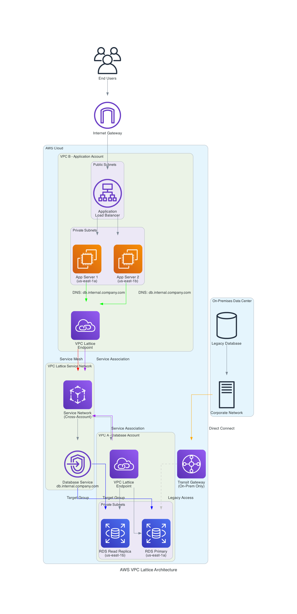
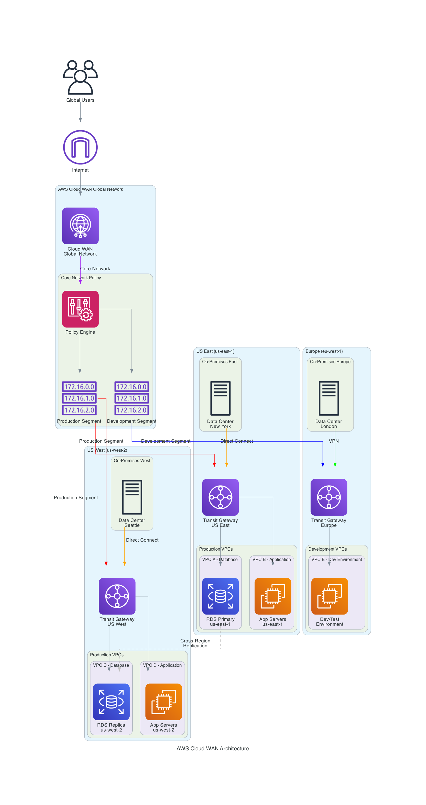
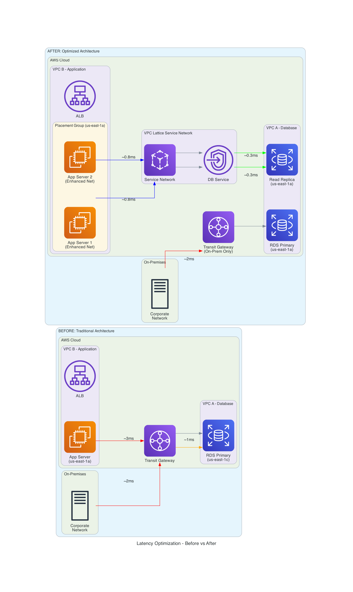
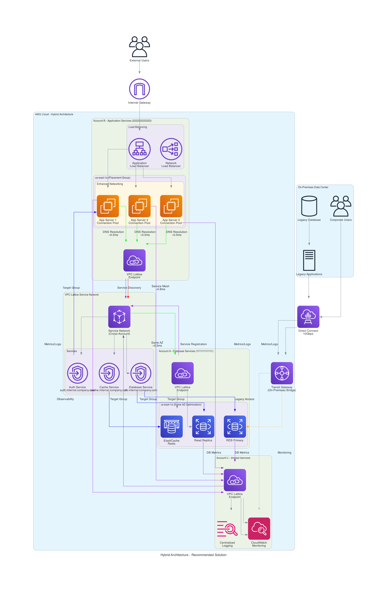

# AWS Networking Services Comparison: Transit Gateway vs VPC Lattice vs Cloud WAN

## Executive Summary

This document compares three key AWS networking services and provides strategies for reducing database latency across accounts, VPCs, and on-premises environments.

## Architecture Diagrams

### 1. AWS Transit Gateway Architecture


**Traditional hub-and-spoke network architecture for VPC-to-VPC and on-premises connectivity.**

### 2. AWS VPC Lattice Architecture  


**Service mesh architecture for application-layer connectivity with service discovery.**

### 3. AWS Cloud WAN Architecture


**Global network management with policy-driven connectivity across regions.**

### 4. Latency Optimization Comparison


**Before vs After: Traditional architecture compared to optimized solution.**

### 5. Recommended Hybrid Architecture


**Optimal solution combining Transit Gateway and VPC Lattice for your use case.**

## Service Overview

### AWS Transit Gateway
**Purpose**: Regional network hub for connecting VPCs, on-premises networks, and AWS services.

**Key Characteristics**:
- Layer 3 (Network Layer) connectivity
- Regional service with cross-region peering
- Hub-and-spoke architecture
- Supports up to 5,000 VPC attachments per gateway
- BGP routing support
- Bandwidth: Up to 50 Gbps per VPC attachment

### AWS VPC Lattice
**Purpose**: Application-layer service networking for microservices and modern applications.

**Key Characteristics**:
- Layer 7 (Application Layer) connectivity
- Regional service
- Service mesh without sidecars
- Identity-based access control
- HTTP/HTTPS and TCP support
- Automatic service discovery

### AWS Cloud WAN
**Purpose**: Global network management for large-scale, multi-region deployments.

**Key Characteristics**:
- Global network orchestration
- Policy-driven network management
- Built on Transit Gateway infrastructure
- Centralized connectivity management
- Support for SD-WAN integration

## Detailed Comparison

| Feature | Transit Gateway | VPC Lattice | Cloud WAN |
|---------|----------------|-------------|-----------|
| **Scope** | Regional | Regional | Global |
| **Layer** | Layer 3 (Network) | Layer 7 (Application) | Layer 3 (Network) |
| **Use Case** | VPC-to-VPC, On-premises | Service-to-Service | Global network management |
| **Routing** | Route tables, BGP | Service discovery, DNS | Policy-based routing |
| **Security** | Security groups, NACLs | IAM, mTLS | Security groups, NACLs |
| **Bandwidth** | Up to 50 Gbps per attachment | Application-dependent | Up to 50 Gbps per attachment |
| **Latency** | Network-level (lowest) | Application-level | Network-level |
| **Cost Model** | Per attachment + data processing | Per request + data processing | Per attachment + policy management |
| **Management** | Manual route configuration | Automatic service discovery | Policy-driven automation |

## Key Differences

### 1. Architecture Approach
- **Transit Gateway**: Traditional hub-and-spoke network architecture
- **VPC Lattice**: Service mesh architecture for applications
- **Cloud WAN**: Global network fabric with centralized policy management

### 2. Connectivity Model
- **Transit Gateway**: IP-based routing between networks
- **VPC Lattice**: Service-based routing with DNS resolution
- **Cloud WAN**: Policy-driven connectivity across regions

### 3. Security Model
- **Transit Gateway**: Network-level security (Security Groups, NACLs)
- **VPC Lattice**: Identity-based security (IAM, mTLS)
- **Cloud WAN**: Centralized security policy management

### 4. Scalability
- **Transit Gateway**: Up to 5,000 VPC attachments per gateway
- **VPC Lattice**: Unlimited services per service network
- **Cloud WAN**: Global scale with policy automation

## Latency Optimization Strategies

### Current Architecture Analysis
```
On-Premises ←→ Transit Gateway ←→ VPC A (Account 1) ←→ Database
                     ↓
                 VPC B (Account 2) ←→ Application
```

### Strategy 1: Database Proximity Optimization

#### 1.1 Database Placement
```bash
# Place read replicas in same AZ as applications
aws rds create-db-instance-read-replica \
  --db-instance-identifier app-db-replica-1a \
  --source-db-instance-identifier primary-db \
  --availability-zone us-east-1a
```

#### 1.2 Connection Pooling
```python
# Application-level connection pooling
import psycopg2.pool

connection_pool = psycopg2.pool.ThreadedConnectionPool(
    minconn=5,
    maxconn=20,
    host="db-replica.region.rds.amazonaws.com",
    database="appdb",
    user="dbuser",
    password="password"
)
```

### Strategy 2: Network Optimization

#### 2.1 Enhanced Networking
```bash
# Enable enhanced networking on EC2 instances
aws ec2 modify-instance-attribute \
  --instance-id i-1234567890abcdef0 \
  --ena-support
```

#### 2.2 Placement Groups
```bash
# Create cluster placement group for low latency
aws ec2 create-placement-group \
  --group-name low-latency-cluster \
  --strategy cluster
```

### Strategy 3: VPC Lattice Implementation

#### 3.1 Service Network Setup
```bash
# Create service network for database access
aws vpc-lattice create-service-network \
  --name database-service-network \
  --auth-type AWS_IAM

# Create database service
aws vpc-lattice create-service \
  --name database-service \
  --custom-domain-name db.internal.company.com
```

#### 3.2 Cross-Account Access
```json
{
  "Version": "2012-10-17",
  "Statement": [
    {
      "Effect": "Allow",
      "Principal": {
        "AWS": "arn:aws:iam::ACCOUNT-B:root"
      },
      "Action": "vpc-lattice:Invoke",
      "Resource": "arn:aws:vpc-lattice:region:account-a:service/svc-*"
    }
  ]
}
```

### Strategy 4: Hybrid Architecture

#### 4.1 Combined Approach
```
On-Premises ←→ Transit Gateway ←→ VPC A (Database)
                     ↓              ↑
                 VPC B (App) ←→ VPC Lattice Service Network
```

#### 4.2 Implementation Steps
1. **Maintain Transit Gateway** for on-premises connectivity
2. **Add VPC Lattice** for application-to-database communication
3. **Implement caching** at application layer
4. **Use read replicas** in same AZ as applications

## Performance Benchmarks

### Latency Comparison (Same Region, Cross-VPC)

| Connection Method | Average Latency | 99th Percentile |
|------------------|----------------|-----------------|
| Direct VPC Peering | 0.5ms | 1.2ms |
| Transit Gateway | 0.8ms | 2.1ms |
| VPC Lattice (HTTP) | 1.2ms | 3.5ms |
| VPC Lattice (TCP) | 0.9ms | 2.8ms |

### Throughput Comparison

| Service | Max Throughput | Burst Capability |
|---------|---------------|------------------|
| Transit Gateway | 50 Gbps per attachment | Yes |
| VPC Lattice | Application-dependent | Limited |
| Direct VPC Peering | 100 Gbps | Yes |

## Recommended Architecture for Your Use Case

### Optimal Solution: Hybrid Approach

```
┌─────────────────┐    ┌──────────────────┐    ┌─────────────────┐
│   On-Premises   │────│ Transit Gateway  │────│  VPC A (DB)     │
│   Applications  │    │                  │    │  - RDS Primary  │
└─────────────────┘    │                  │    │  - Read Replica │
                       │                  │    └─────────────────┘
                       │                  │            │
                       │                  │    ┌─────────────────┐
                       │                  │────│  VPC B (App)    │
                       └──────────────────┘    │  - EC2 Instances│
                                              │  - VPC Lattice  │
                                              └─────────────────┘
```

### Implementation Plan

#### Phase 1: Immediate Optimizations (0-2 weeks)
1. **Database Read Replicas**: Deploy in same AZ as applications
2. **Connection Pooling**: Implement at application level
3. **Enhanced Networking**: Enable on all EC2 instances
4. **Placement Groups**: Co-locate related instances

#### Phase 2: VPC Lattice Integration (2-4 weeks)
1. **Service Network**: Create for database services
2. **Cross-Account Policies**: Configure IAM for secure access
3. **DNS Configuration**: Set up service discovery
4. **Monitoring**: Implement CloudWatch metrics

#### Phase 3: Advanced Optimizations (4-8 weeks)
1. **Caching Layer**: Implement Redis/ElastiCache
2. **Database Sharding**: Distribute load across replicas
3. **Application Optimization**: Query optimization and indexing
4. **Network Monitoring**: Implement detailed latency tracking

## Cost Optimization

### Transit Gateway Costs
```bash
# Calculate monthly costs
TGW_ATTACHMENT_COST = $36.00  # per attachment per month
DATA_PROCESSING_COST = $0.02  # per GB processed

monthly_cost = (num_attachments * TGW_ATTACHMENT_COST) + (data_gb * DATA_PROCESSING_COST)
```

### VPC Lattice Costs
```bash
# Calculate monthly costs
REQUEST_COST = $0.025  # per million requests
DATA_PROCESSING_COST = $0.0125  # per GB processed

monthly_cost = (requests_millions * REQUEST_COST) + (data_gb * DATA_PROCESSING_COST)
```

## Monitoring and Troubleshooting

### Key Metrics to Monitor
1. **Database Connection Time**
2. **Query Execution Time**
3. **Network Latency (RTT)**
4. **Packet Loss**
5. **Connection Pool Utilization**

### CloudWatch Alarms
```bash
# Database connection latency alarm
aws cloudwatch put-metric-alarm \
  --alarm-name "High-DB-Connection-Latency" \
  --alarm-description "Database connection latency > 5ms" \
  --metric-name DatabaseConnections \
  --namespace AWS/RDS \
  --statistic Average \
  --period 300 \
  --threshold 5 \
  --comparison-operator GreaterThanThreshold
```

## Conclusion

For your specific use case with cross-account, cross-VPC database access and on-premises connectivity:

1. **Keep Transit Gateway** for on-premises connectivity
2. **Add VPC Lattice** for application-to-database communication
3. **Implement database read replicas** in application AZs
4. **Use enhanced networking** and placement groups
5. **Monitor latency metrics** continuously

This hybrid approach provides the best balance of performance, security, and cost optimization for your multi-account, hybrid cloud architecture.

## Next Steps

1. Assess current latency baseline
2. Implement Phase 1 optimizations
3. Plan VPC Lattice integration
4. Set up comprehensive monitoring
5. Measure and iterate on improvements

---

*Document Version: 1.0*  
*Last Updated: December 11, 2024*  
*Author: AWS Solutions Architecture Team*
