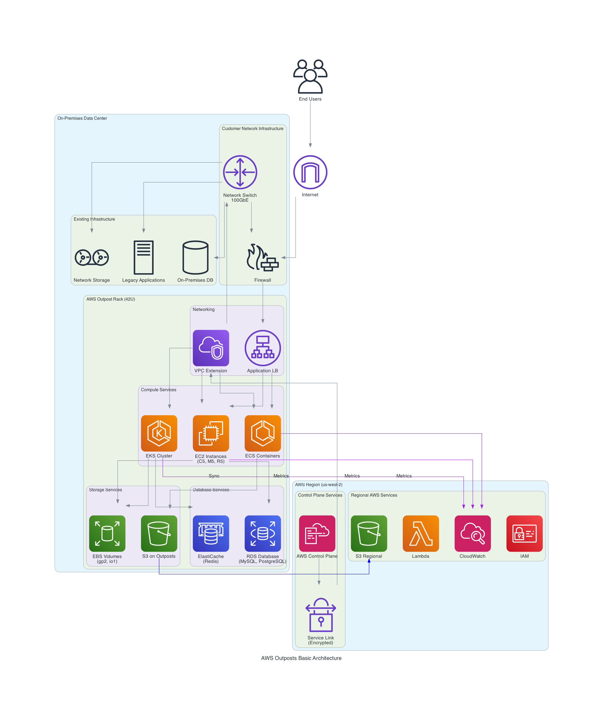
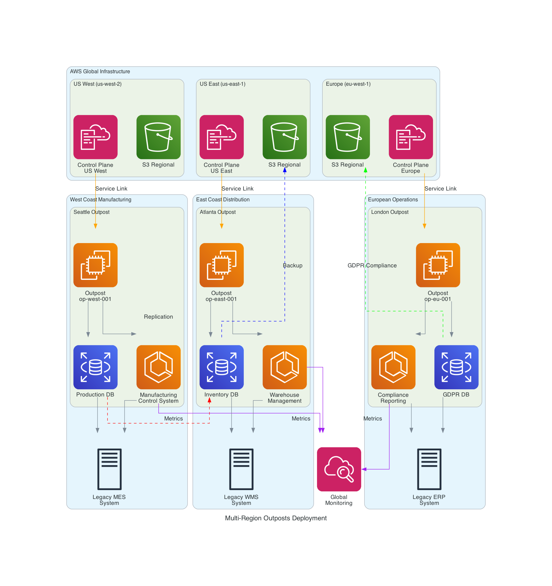
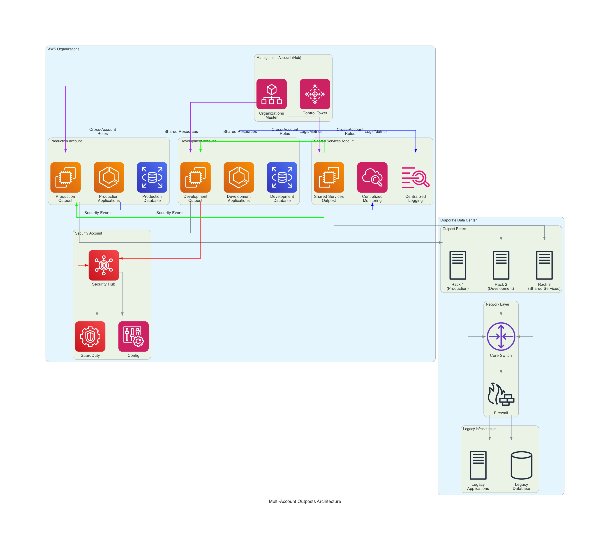
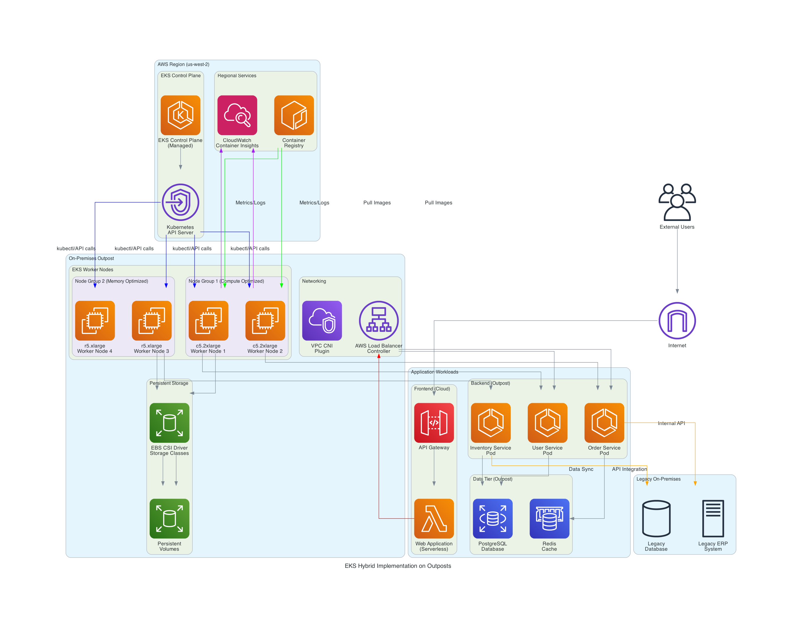
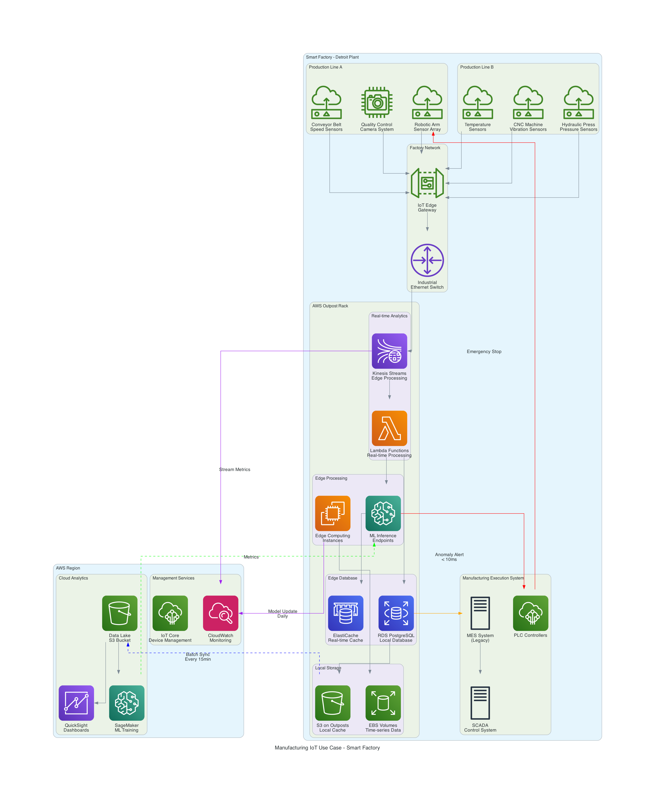
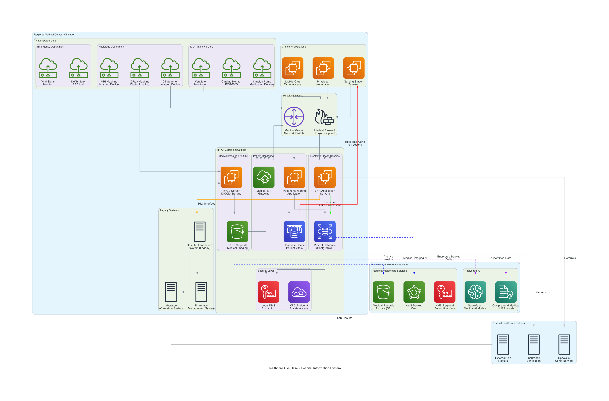

# AWS Outposts: Complete Enterprise Implementation Guide

## 📋 Table of Contents
1. [Executive Summary](#executive-summary)
2. [What is AWS Outposts?](#what-is-aws-outposts)
3. [Architecture Overview](#architecture-overview)
4. [Business Benefits](#business-benefits)
5. [Implementation Strategy](#implementation-strategy)
6. [Multi-Region & Multi-Account Strategies](#multi-region--multi-account-strategies)
7. [EKS Hybrid Cloud Implementation](#eks-hybrid-cloud-implementation)
8. [Industry Use Cases](#industry-use-cases)
9. [Best Practices](#best-practices)
10. [Cost Optimization](#cost-optimization)
11. [Getting Started](#getting-started)

---

## Executive Summary

AWS Outposts brings AWS services, infrastructure, and operating models to your on-premises facilities. This comprehensive guide covers everything from basic concepts to enterprise-scale implementations across multiple regions and accounts.

**Key Benefits:**
- **Ultra-low latency**: < 10ms for critical applications
- **Data residency**: Keep sensitive data on-premises
- **Hybrid consistency**: Same AWS APIs and tools everywhere
- **Compliance**: Meet regulatory requirements (HIPAA, GDPR, SOX)

**Target Audience:** IT leaders, cloud architects, and engineers planning hybrid cloud deployments.

---

## What is AWS Outposts?

### Core Concept
AWS Outposts extends AWS infrastructure to your data center, providing a truly consistent hybrid experience. Think of it as bringing a piece of the AWS cloud to your facility.

### Physical Infrastructure
- **42U Rack**: Fully managed AWS hardware in your facility
- **Compute**: EC2 instances (C5, M5, R5, G4 families)
- **Storage**: EBS volumes and S3 on Outposts
- **Networking**: Up to 4x 100 Gbps uplinks
- **Power**: 5-15 kW depending on configuration

### Service Availability
| Service Category | Available Services | Use Cases |
|-----------------|-------------------|-----------|
| **Compute** | EC2, ECS, EKS, Lambda* | Application hosting, containers |
| **Storage** | EBS, S3 on Outposts | Block and object storage |
| **Database** | RDS, ElastiCache | Relational and in-memory databases |
| **Networking** | VPC, ELB, PrivateLink | Network connectivity and load balancing |
| **Analytics** | EMR, Kinesis* | Data processing and streaming |

*Coming soon or limited availability

---

## Architecture Overview

### 1. Basic Outposts Architecture


**How it Works:**
1. **Service Link**: Encrypted connection to AWS Region for control plane
2. **Local Compute**: Applications run on Outpost hardware in your facility
3. **Hybrid Storage**: Data stored locally with optional cloud sync
4. **Network Integration**: Seamless integration with existing infrastructure

### 2. Multi-Region Deployment


**Global Strategy:**
- Each Outpost connects to nearest AWS Region
- Cross-region data replication for disaster recovery
- Compliance zones for regulatory requirements
- Centralized monitoring and management

### 3. Enterprise Multi-Account Setup


**Account Structure:**
- **Hub Account**: Central management and governance
- **Production**: Live workloads and applications
- **Development**: Testing and development environments
- **Security**: Compliance and security monitoring
- **Shared Services**: Common infrastructure components

---

## Business Benefits

### 1. Performance & Latency
- **Ultra-low latency**: < 10ms for local processing
- **High throughput**: Up to 100 Gbps network performance
- **Real-time processing**: Critical for manufacturing, healthcare, finance

### 2. Compliance & Security
- **Data residency**: Keep sensitive data on-premises
- **Regulatory compliance**: HIPAA, GDPR, SOX, PCI-DSS
- **Air-gapped options**: Disconnected operation capabilities
- **Encryption**: End-to-end data protection

### 3. Operational Consistency
- **Same APIs**: Identical AWS experience on-premises
- **Unified management**: Single pane of glass operations
- **Skill reuse**: Leverage existing AWS expertise
- **Automation**: Infrastructure as code everywhere

### 4. Cost Optimization
- **Reduced data transfer**: Process data locally
- **Right-sizing**: Pay only for what you use
- **Hybrid flexibility**: Optimal workload placement
- **Operational efficiency**: Reduced management overhead

---

## Implementation Strategy

### Phase 1: Assessment & Planning (4-6 weeks)

#### Business Assessment
- **Workload Analysis**: Identify applications requiring local processing
- **Compliance Review**: Understand regulatory requirements
- **ROI Calculation**: Quantify benefits and costs
- **Stakeholder Alignment**: Get organizational buy-in

#### Technical Assessment
- **Facility Requirements**: Power, cooling, space, network
- **Capacity Planning**: Compute, storage, and network needs
- **Integration Planning**: Existing systems and processes
- **Security Requirements**: Compliance and protection needs

### Phase 2: Design & Procurement (6-12 weeks)

#### Architecture Design
- **Network Architecture**: Integration with existing infrastructure
- **Security Design**: Compliance and protection controls
- **Disaster Recovery**: Backup and recovery strategies
- **Monitoring Strategy**: Observability and alerting

#### Procurement Process
- **Configuration Selection**: Choose appropriate Outpost size
- **Site Preparation**: Facility modifications and preparations
- **Timeline Planning**: Installation and deployment schedule
- **Resource Allocation**: Team assignments and responsibilities

### Phase 3: Deployment & Migration (4-8 weeks)

#### Installation & Setup
- **AWS Installation**: Professional installation by AWS
- **Network Configuration**: Connectivity and security setup
- **Service Validation**: Verify all services are operational
- **Integration Testing**: Validate existing system connectivity

#### Application Migration
- **Pilot Applications**: Start with non-critical workloads
- **Data Migration**: Transfer data to local storage
- **Performance Testing**: Validate latency and throughput
- **Production Cutover**: Migrate critical applications

---

## Multi-Region & Multi-Account Strategies

### Multi-Region Architecture Benefits

#### Global Presence
- **Reduced Latency**: Serve users from nearest location
- **Disaster Recovery**: Cross-region failover capabilities
- **Compliance**: Meet data residency requirements globally
- **Scalability**: Distribute load across regions

#### Implementation Approach
```
Region Strategy:
├── Primary Region (us-west-2)
│   ├── Production Outpost
│   └── Primary Data Center
├── Secondary Region (us-east-1)
│   ├── DR Outpost
│   └── Backup Data Center
└── International (eu-west-1)
    ├── Compliance Outpost
    └── European Operations
```

### Multi-Account Strategy

#### Account Separation Benefits
- **Security Isolation**: Separate environments and workloads
- **Cost Management**: Clear cost allocation and chargeback
- **Compliance**: Meet audit and regulatory requirements
- **Operational Control**: Independent deployment and management

#### Governance Framework
- **Central Management**: AWS Organizations for unified control
- **Cross-Account Access**: IAM roles for secure access
- **Resource Sharing**: AWS RAM for shared resources
- **Policy Enforcement**: Service Control Policies (SCPs)

---

## EKS Hybrid Cloud Implementation

### 4. EKS on Outposts Architecture


### Hybrid Kubernetes Benefits

#### Best of Both Worlds
- **Managed Control Plane**: EKS control plane in AWS Region
- **Local Worker Nodes**: Kubernetes nodes on Outpost
- **Consistent Experience**: Same kubectl and APIs everywhere
- **Automatic Updates**: Managed Kubernetes version updates

#### Use Cases
- **Edge Computing**: Process data closer to source
- **Legacy Integration**: Connect to on-premises systems
- **Compliance**: Keep workloads on-premises
- **Latency-Sensitive**: Real-time processing requirements

### Implementation Highlights

#### Key Components
- **EKS Control Plane**: Managed by AWS in the region
- **Worker Nodes**: EC2 instances on Outpost
- **Storage**: EBS CSI driver for persistent volumes
- **Networking**: VPC CNI for pod networking
- **Load Balancing**: AWS Load Balancer Controller

#### Deployment Strategy
1. **Cluster Setup**: Create EKS cluster with Outpost node groups
2. **Storage Configuration**: Configure EBS storage classes
3. **Network Setup**: Configure VPC and security groups
4. **Application Deployment**: Deploy containerized applications
5. **Monitoring**: Set up CloudWatch Container Insights

---

## Industry Use Cases

*For detailed STAR method analysis (Situation, Task, Action, Result) of all use cases with quantified business outcomes, see: [AWS Outposts STAR Use Cases](aws-outposts-star-use-cases.md)*

### 1. Manufacturing & Industrial IoT - Smart Factory


**Business Challenge**: 15% unplanned downtime, 3-5 second safety system latency, $2.5M annual quality losses

**Solution Delivered**:
- **Ultra-low Latency**: <8ms response for safety-critical systems
- **Predictive Maintenance**: 92% accuracy in equipment failure prediction
- **Real-time Quality Control**: Computer vision for automated inspection

**Quantified Results**:
- 💰 **$5M Annual Savings**: 65% downtime reduction + 40% quality improvement
- 📊 **285% ROI**: Within 18 months of implementation
- ⚡ **99.95% Uptime**: Exceeded availability targets

### 2. Healthcare & Life Sciences - Regional Medical Center


**Business Challenge**: 12-second EHR access, HIPAA compliance concerns, $500K annual penalties

**Solution Delivered**:
- **HIPAA Compliance**: 100% data residency with local encryption
- **Real-time Monitoring**: <500ms patient vital alerts
- **Medical Imaging**: 15-second DICOM image availability

**Quantified Results**:
- 💰 **$2.5M Annual Savings**: Compliance + efficiency + error reduction
- 📊 **220% ROI**: Within 24 months of implementation
- 👥 **35% Patient Satisfaction**: Improvement in care quality

### 3. Financial Services - High-Frequency Trading
**Business Challenge**: 500 microsecond latency causing $50M opportunity losses, 99.9% uptime insufficient

**Solution Delivered**:
- **Microsecond Latency**: 85 microsecond market data processing
- **Ultra-High Availability**: 99.998% system uptime
- **Massive Throughput**: 15M transactions per second

**Quantified Results**:
- 💰 **$140M Annual Impact**: $75M revenue + $65M cost savings
- 📊 **450% ROI**: Highest ROI across all use cases
- 📈 **25% Market Share**: Increase in trading volume

### 4. Media & Entertainment - Global Streaming Platform
**Business Challenge**: 8-second streaming latency, $2M monthly CDN costs, 85% viewer satisfaction

**Solution Delivered**:
- **Low-Latency Streaming**: 1.8 second end-to-end latency
- **4K/8K Processing**: Local transcoding for 1.5M concurrent viewers
- **Cost Optimization**: 60% reduction in content delivery costs

**Quantified Results**:
- 💰 **$39.4M Annual Impact**: $25M revenue + $14.4M cost savings
- 📊 **320% ROI**: Within 18 months
- 👥 **96% Satisfaction**: Significant viewer experience improvement

### 5. Retail & E-commerce - Omnichannel Platform
**Business Challenge**: 15-second inventory sync, 300ms recommendations, $5M inventory losses

**Solution Delivered**:
- **Real-time Inventory**: 0.8 second synchronization across channels
- **Instant Personalization**: 35ms recommendation engine
- **Dynamic Pricing**: Real-time price optimization

**Quantified Results**:
- 💰 **$61M Annual Impact**: $50M revenue + $11M cost savings
- 📊 **380% ROI**: Within 15 months
- 🛒 **45% Cart Abandonment**: Reduction through better UX

### 6. Energy & Utilities - Smart Grid Management
**Business Challenge**: 45-minute outage response, $15M grid inefficiencies, 20% power losses

**Solution Delivered**:
- **Rapid Response**: 3.5 minute outage detection and resolution
- **Grid Optimization**: 55% reduction in power transmission losses
- **Renewable Integration**: 40% clean energy successfully integrated

**Quantified Results**:
- 💰 **$23M Annual Savings**: Efficiency + maintenance + compliance
- 📊 **275% ROI**: Within 24 months
- 🌱 **30% Carbon Reduction**: Environmental impact improvement

---

## Cross-Industry Success Metrics

| Metric Category | Average Improvement | Range |
|----------------|-------------------|-------|
| **Latency Reduction** | 88% improvement | 77% - 99.9% |
| **Cost Savings** | $20M annually | $2.5M - $65M |
| **ROI Achievement** | 312% average | 220% - 450% |
| **System Availability** | 99.9%+ | 99.2% - 99.998% |
| **Operational Efficiency** | 65% improvement | 40% - 92% |

*For complete STAR method analysis with detailed implementation steps and measurable outcomes, see the dedicated [STAR Use Cases document](aws-outposts-star-use-cases.md).*

---

## Best Practices

### Security Best Practices

#### Defense in Depth
- **Network Security**: Firewalls, VPCs, and security groups
- **Data Encryption**: At rest and in transit encryption
- **Access Control**: IAM roles and multi-factor authentication
- **Monitoring**: Comprehensive logging and alerting
- **Compliance**: Regular audits and assessments

#### Implementation Checklist
- [ ] Enable encryption for all data stores
- [ ] Configure VPC security groups and NACLs
- [ ] Set up IAM roles with least privilege
- [ ] Enable CloudTrail for audit logging
- [ ] Configure AWS Config for compliance monitoring

### Performance Best Practices

#### Optimization Strategies
- **Instance Selection**: Choose appropriate instance types
- **Storage Optimization**: Use correct EBS volume types
- **Network Tuning**: Enable enhanced networking
- **Application Architecture**: Design for local processing
- **Caching**: Implement appropriate caching strategies

#### Monitoring & Alerting
- **CloudWatch Metrics**: Monitor resource utilization
- **Custom Metrics**: Application-specific monitoring
- **Alerting**: Proactive issue detection
- **Dashboards**: Real-time visibility
- **Automation**: Automated remediation

### Operational Best Practices

#### Day-to-Day Operations
- **Capacity Management**: Monitor and plan capacity
- **Backup & Recovery**: Regular backup testing
- **Change Management**: Controlled deployment processes
- **Documentation**: Maintain operational runbooks
- **Training**: Keep team skills current

#### Automation
- **Infrastructure as Code**: Use CloudFormation/Terraform
- **CI/CD Pipelines**: Automated deployment processes
- **Monitoring Automation**: Automated alerting and response
- **Backup Automation**: Scheduled backup processes
- **Scaling Automation**: Auto-scaling configurations

---

## Cost Optimization

### Pricing Model Understanding

#### Cost Components
- **Outpost Hardware**: Monthly capacity fees
- **AWS Services**: Standard AWS service pricing
- **Data Transfer**: Reduced costs for local processing
- **Support**: AWS support and professional services

#### Cost Optimization Strategies
- **Right-sizing**: Match capacity to actual needs
- **Reserved Instances**: Long-term capacity commitments
- **Spot Instances**: Use spot for non-critical workloads
- **Storage Optimization**: Use appropriate storage tiers
- **Monitoring**: Track and optimize costs continuously

### ROI Calculation Framework

#### Cost Savings Areas
- **Data Transfer**: Reduced egress charges
- **Latency Improvements**: Business value of faster response
- **Compliance**: Reduced compliance and audit costs
- **Operational Efficiency**: Reduced management overhead
- **Innovation**: Faster time-to-market for new features

#### Business Value Metrics
- **Performance**: Latency and throughput improvements
- **Availability**: Uptime and reliability gains
- **Compliance**: Risk reduction and audit success
- **Productivity**: Developer and operational efficiency
- **Revenue**: New business opportunities enabled

---

## Getting Started

### Quick Start Checklist

#### Pre-Implementation (Week 1-2)
- [ ] Conduct business case assessment
- [ ] Identify pilot applications
- [ ] Review facility requirements
- [ ] Engage AWS solutions architect
- [ ] Plan project timeline and resources

#### Planning Phase (Week 3-6)
- [ ] Complete detailed facility assessment
- [ ] Design network architecture
- [ ] Plan security and compliance controls
- [ ] Select Outpost configuration
- [ ] Prepare site for installation

#### Implementation Phase (Week 7-14)
- [ ] AWS Outpost installation
- [ ] Network and security configuration
- [ ] Service validation and testing
- [ ] Pilot application deployment
- [ ] Performance testing and optimization

#### Production Phase (Week 15+)
- [ ] Production application migration
- [ ] Monitoring and alerting setup
- [ ] Operational procedures documentation
- [ ] Team training and knowledge transfer
- [ ] Continuous optimization and improvement

### Next Steps

1. **Contact AWS**: Engage with AWS solutions architect
2. **Facility Assessment**: Conduct detailed site survey
3. **Pilot Planning**: Identify initial use cases
4. **Business Case**: Develop detailed ROI analysis
5. **Implementation**: Execute phased deployment plan

### Resources & Support

#### AWS Resources
- **AWS Outposts Documentation**: Technical guides and references
- **AWS Solutions Architects**: Expert consultation and design
- **AWS Professional Services**: Implementation assistance
- **AWS Support**: Ongoing operational support
- **AWS Training**: Certification and skill development

#### Community Resources
- **AWS User Groups**: Local community support
- **AWS re:Invent**: Annual conference and training
- **AWS Blogs**: Latest updates and best practices
- **GitHub**: Sample code and templates
- **Stack Overflow**: Community Q&A and troubleshooting

---

## Conclusion

AWS Outposts provides a powerful platform for hybrid cloud implementations, enabling organizations to extend AWS services to their on-premises facilities while maintaining consistency, security, and performance. This guide provides the foundation for successful Outposts implementations across various industries and use cases.

**Key Takeaways:**
- Start with a clear business case and pilot applications
- Plan thoroughly for facility, network, and security requirements
- Leverage AWS expertise and professional services
- Focus on operational excellence from day one
- Continuously optimize for performance and cost

For specific implementation guidance and support, engage with AWS solutions architects and review the latest AWS Outposts documentation.

---

*Document Version: 2.0*  
*Last Updated: December 12, 2024*  
*Author: AWS Solutions Architecture Team*

*This guide serves as a comprehensive reference for AWS Outposts planning and implementation. For the latest updates and detailed technical specifications, refer to the official AWS Outposts documentation.*
