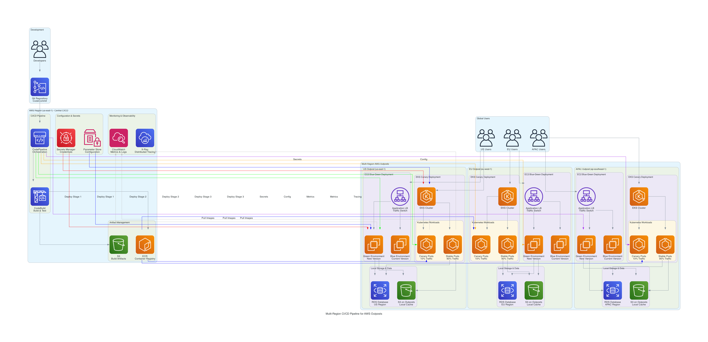

# AWS Outposts Multi-Region Application Upgrade - STAR Method Use Case

## Overview
This document presents a comprehensive STAR method analysis of deploying and upgrading identical applications across multiple AWS Outposts regions using CI/CD pipelines, covering both EC2 and EKS deployment scenarios.

## Multi-Region CI/CD Architecture


**Comprehensive CI/CD Architecture**: This diagram illustrates the complete multi-region CI/CD pipeline for AWS Outposts, showing centralized orchestration in AWS Region with distributed deployment across multiple Outpost locations. The architecture demonstrates both EC2 blue-green deployments and EKS canary deployments, with centralized configuration management and monitoring.

**Key Pipeline Components**:
- **Central CI/CD**: CodePipeline orchestration with CodeBuild for testing and artifact creation
- **Artifact Management**: ECR for container images and S3 for build artifacts
- **Configuration Management**: Parameter Store and Secrets Manager for centralized config
- **Multi-Region Deployment**: Sequential deployment across US, EU, and APAC Outposts
- **Deployment Strategies**: Blue-green for EC2 applications, canary for Kubernetes workloads
- **Monitoring**: CloudWatch metrics and X-Ray tracing across all regions

---

## Use Case: Global E-commerce Platform - Multi-Region Application Upgrade Strategy

### 🌍 **Situation**
**Company**: GlobalShop Inc. (Leading E-commerce Platform)  
**Infrastructure**: 12 AWS Outposts across 6 regions (Americas, EMEA, APAC)  
**Challenge**: The company was struggling with:

#### Application Deployment Challenges:
- **Manual Deployment Process**: 8-hour deployment window per region for application updates
- **Inconsistent Versions**: Different application versions running across regions causing feature disparities
- **Downtime Impact**: $2M revenue loss per hour during deployment windows
- **Rollback Complexity**: 4-6 hours to rollback failed deployments across all regions
- **Compliance Issues**: Regulatory requirements for identical application behavior globally
- **Resource Waste**: 40% over-provisioning due to manual capacity planning

#### Technical Debt:
- **Legacy CI/CD**: Monolithic deployment pipeline taking 12 hours for global rollout
- **Configuration Drift**: 30% of configurations different across regions
- **Testing Gaps**: No automated testing in production-like Outpost environments
- **Monitoring Blind Spots**: Limited visibility into cross-region application performance
- **Security Vulnerabilities**: Delayed security patches due to complex deployment process

#### Business Impact:
- **Customer Experience**: 25% of users experiencing inconsistent features
- **Revenue Loss**: $50M annual loss from deployment-related downtime
- **Operational Overhead**: 15 engineers dedicated to manual deployment management
- **Compliance Risk**: $10M potential penalties for regulatory non-compliance
- **Market Responsiveness**: 3-week delay for new feature rollouts globally

### 🎯 **Task**
**Objective**: Implement automated multi-region application upgrade system that:

#### Performance Requirements:
- **Deployment Speed**: Reduce global deployment time from 8 hours to 30 minutes
- **Zero Downtime**: Achieve blue-green deployments with <1 second switchover
- **Consistency**: Ensure 100% identical application versions across all regions
- **Rollback Speed**: Enable <5 minute rollback capability for failed deployments
- **Scalability**: Support deployment to 50+ Outposts without linear time increase

#### Technical Requirements:
- **CI/CD Automation**: Fully automated pipeline from code commit to production
- **Multi-Platform Support**: Support both EC2 and EKS application deployments
- **Configuration Management**: Centralized configuration with region-specific overrides
- **Testing Integration**: Automated testing at each stage including Outpost environments
- **Monitoring**: Real-time visibility into deployment status across all regions

#### Business Requirements:
- **Cost Optimization**: Reduce deployment operational costs by 70%
- **Compliance**: Maintain regulatory compliance across all regions
- **Risk Mitigation**: Minimize deployment-related business disruption
- **Developer Productivity**: Enable developers to focus on features, not deployments

### ⚡ **Action**
**AWS Outposts Multi-Region CI/CD Implementation**:

#### Architecture Overview
```
┌─────────────────────────────────────────────────────────────────┐
│                     AWS Control Plane (us-east-1)              │
│  ┌─────────────────┐  ┌─────────────────┐  ┌─────────────────┐ │
│  │   CodeCommit    │  │   CodeBuild     │  │   CodePipeline  │ │
│  │   Source Repo   │  │   Build/Test    │  │   Orchestration │ │
│  └─────────────────┘  └─────────────────┘  └─────────────────┘ │
│  ┌─────────────────┐  ┌─────────────────┐  ┌─────────────────┐ │
│  │      ECR        │  │   Parameter     │  │   CloudWatch    │ │
│  │ Container Reg   │  │     Store       │  │   Monitoring    │ │
│  └─────────────────┘  └─────────────────┘  └─────────────────┘ │
└─────────────────────────────────────────────────────────────────┘
                              │
                    ┌─────────┴─────────┐
                    │   Global CDN      │
                    │   Artifact Dist   │
                    └─────────┬─────────┘
┌─────────────────────────────┼─────────────────────────────────────┐
│                    Regional Outposts                            │
│                                                                 │
│  ┌─────────────────┐  ┌─────────────────┐  ┌─────────────────┐ │
│  │   US Outpost    │  │   EU Outpost    │  │  APAC Outpost   │ │
│  │                 │  │                 │  │                 │ │
│  │ ┌─────────────┐ │  │ ┌─────────────┐ │  │ ┌─────────────┐ │ │
│  │ │EC2 Apps     │ │  │ │EC2 Apps     │ │  │ │EC2 Apps     │ │ │
│  │ │Blue/Green   │ │  │ │Blue/Green   │ │  │ │Blue/Green   │ │ │
│  │ └─────────────┘ │  │ └─────────────┘ │  │ └─────────────┘ │ │
│  │ ┌─────────────┐ │  │ ┌─────────────┐ │  │ ┌─────────────┐ │ │
│  │ │EKS Cluster  │ │  │ │EKS Cluster  │ │  │ │EKS Cluster  │ │ │
│  │ │Canary Deploy│ │  │ │Canary Deploy│ │  │ │Canary Deploy│ │ │
│  │ └─────────────┘ │  │ └─────────────┘ │  │ └─────────────┘ │ │
│  └─────────────────┘  └─────────────────┘  └─────────────────┘ │
└─────────────────────────────────────────────────────────────────┘
```

#### Implementation Components

##### 1. **Centralized CI/CD Pipeline**
```yaml
# CodePipeline Configuration
pipeline_stages:
  - source:
      provider: CodeCommit
      repository: globalshop-application
      branch: main
      
  - build:
      provider: CodeBuild
      projects:
        - unit_tests
        - security_scan
        - container_build
        - infrastructure_validation
        
  - test:
      environments:
        - outpost_staging_us
        - outpost_staging_eu
        - outpost_staging_apac
      tests:
        - integration_tests
        - performance_tests
        - security_tests
        
  - deploy:
      strategy: blue_green
      regions:
        - us_outposts
        - eu_outposts
        - apac_outposts
      rollout: canary_10_50_100
```

##### 2. **EC2 Application Deployment Strategy**
```python
# Blue-Green Deployment for EC2 Applications
class EC2BlueGreenDeployment:
    def __init__(self, outpost_config):
        self.outpost_config = outpost_config
        self.deployment_strategy = "blue_green"
        
    def deploy_application(self, app_version, region):
        """Deploy application using blue-green strategy"""
        
        # Create new environment (Green)
        green_environment = self.create_environment(
            app_version=app_version,
            environment_type="green",
            region=region
        )
        
        # Health check new environment
        if self.health_check(green_environment):
            # Switch traffic to green environment
            self.switch_traffic(green_environment)
            # Terminate blue environment
            self.cleanup_blue_environment()
        else:
            # Rollback - keep blue environment
            self.cleanup_failed_deployment(green_environment)
            
    def create_environment(self, app_version, environment_type, region):
        """Create new EC2 environment on Outpost"""
        
        launch_template = {
            'ImageId': f'ami-app-{app_version}',
            'InstanceType': 'm5.large',
            'SecurityGroupIds': ['sg-app-security'],
            'UserData': self.generate_user_data(app_version),
            'TagSpecifications': [
                {
                    'ResourceType': 'instance',
                    'Tags': [
                        {'Key': 'Environment', 'Value': environment_type},
                        {'Key': 'AppVersion', 'Value': app_version},
                        {'Key': 'Region', 'Value': region},
                        {'Key': 'DeploymentId', 'Value': self.deployment_id}
                    ]
                }
            ]
        }
        
        # Deploy to Outpost subnet
        auto_scaling_group = {
            'AutoScalingGroupName': f'app-{environment_type}-{region}',
            'LaunchTemplate': launch_template,
            'MinSize': 2,
            'MaxSize': 10,
            'DesiredCapacity': 4,
            'VPCZoneIdentifier': [f'subnet-outpost-{region}'],
            'HealthCheckType': 'ELB',
            'HealthCheckGracePeriod': 300
        }
        
        return auto_scaling_group
```

##### 3. **EKS Application Deployment Strategy**
```yaml
# Kubernetes Canary Deployment Configuration
apiVersion: argoproj.io/v1alpha1
kind: Rollout
metadata:
  name: globalshop-app
  namespace: production
spec:
  replicas: 10
  strategy:
    canary:
      steps:
      - setWeight: 10
      - pause: {duration: 5m}
      - setWeight: 50
      - pause: {duration: 10m}
      - setWeight: 100
      canaryService: globalshop-app-canary
      stableService: globalshop-app-stable
      trafficRouting:
        alb:
          ingress: globalshop-ingress
          servicePort: 80
  selector:
    matchLabels:
      app: globalshop-app
  template:
    metadata:
      labels:
        app: globalshop-app
    spec:
      nodeSelector:
        node-type: outpost
      containers:
      - name: app
        image: "{{.Values.image.repository}}:{{.Values.image.tag}}"
        ports:
        - containerPort: 8080
        env:
        - name: REGION
          value: "{{.Values.region}}"
        - name: APP_VERSION
          value: "{{.Values.image.tag}}"
        resources:
          requests:
            memory: "512Mi"
            cpu: "250m"
          limits:
            memory: "1Gi"
            cpu: "500m"
        livenessProbe:
          httpGet:
            path: /health
            port: 8080
          initialDelaySeconds: 30
          periodSeconds: 10
        readinessProbe:
          httpGet:
            path: /ready
            port: 8080
          initialDelaySeconds: 5
          periodSeconds: 5

---
# ArgoCD Application Configuration
apiVersion: argoproj.io/v1alpha1
kind: Application
metadata:
  name: globalshop-multi-region
  namespace: argocd
spec:
  project: default
  sources:
  - repoURL: https://git.company.com/globalshop/k8s-manifests
    targetRevision: HEAD
    path: overlays/us-outpost
    helm:
      valueFiles:
      - values-us.yaml
  - repoURL: https://git.company.com/globalshop/k8s-manifests
    targetRevision: HEAD
    path: overlays/eu-outpost
    helm:
      valueFiles:
      - values-eu.yaml
  - repoURL: https://git.company.com/globalshop/k8s-manifests
    targetRevision: HEAD
    path: overlays/apac-outpost
    helm:
      valueFiles:
      - values-apac.yaml
  destination:
    server: https://kubernetes.default.svc
  syncPolicy:
    automated:
      prune: true
      selfHeal: true
    syncOptions:
    - CreateNamespace=true
```

##### 4. **Configuration Management**
```python
# Centralized Configuration Management
class ConfigurationManager:
    def __init__(self):
        self.parameter_store = boto3.client('ssm')
        self.secrets_manager = boto3.client('secretsmanager')
        
    def get_region_config(self, region, app_version):
        """Get region-specific configuration"""
        
        base_config = self.get_base_config(app_version)
        region_overrides = self.get_region_overrides(region)
        
        # Merge configurations
        final_config = {**base_config, **region_overrides}
        
        return final_config
    
    def get_base_config(self, app_version):
        """Get base application configuration"""
        
        config = {
            'app_version': app_version,
            'database_pool_size': 20,
            'cache_ttl': 300,
            'api_timeout': 30,
            'log_level': 'INFO',
            'feature_flags': self.get_feature_flags(app_version)
        }
        
        return config
    
    def get_region_overrides(self, region):
        """Get region-specific configuration overrides"""
        
        region_configs = {
            'us-east-1': {
                'database_endpoint': 'db-us-east.outpost.local',
                'cache_endpoint': 'cache-us-east.outpost.local',
                'compliance_mode': 'SOX',
                'data_residency': 'US'
            },
            'eu-west-1': {
                'database_endpoint': 'db-eu-west.outpost.local',
                'cache_endpoint': 'cache-eu-west.outpost.local',
                'compliance_mode': 'GDPR',
                'data_residency': 'EU'
            },
            'ap-southeast-1': {
                'database_endpoint': 'db-ap-southeast.outpost.local',
                'cache_endpoint': 'cache-ap-southeast.outpost.local',
                'compliance_mode': 'PDPA',
                'data_residency': 'APAC'
            }
        }
        
        return region_configs.get(region, {})
```

##### 5. **Automated Testing Framework**
```python
# Multi-Region Testing Automation
class OutpostTestingFramework:
    def __init__(self):
        self.test_environments = [
            'us-outpost-staging',
            'eu-outpost-staging', 
            'apac-outpost-staging'
        ]
        
    def run_comprehensive_tests(self, app_version):
        """Run tests across all Outpost environments"""
        
        test_results = {}
        
        for environment in self.test_environments:
            test_results[environment] = {
                'unit_tests': self.run_unit_tests(environment, app_version),
                'integration_tests': self.run_integration_tests(environment, app_version),
                'performance_tests': self.run_performance_tests(environment, app_version),
                'security_tests': self.run_security_tests(environment, app_version),
                'compliance_tests': self.run_compliance_tests(environment, app_version)
            }
            
        return test_results
    
    def run_performance_tests(self, environment, app_version):
        """Run performance tests on Outpost environment"""
        
        test_config = {
            'load_test': {
                'concurrent_users': 1000,
                'duration': '10m',
                'ramp_up': '2m',
                'success_criteria': {
                    'response_time_95th': '<500ms',
                    'error_rate': '<0.1%',
                    'throughput': '>2000 rps'
                }
            },
            'stress_test': {
                'max_users': 5000,
                'duration': '5m',
                'success_criteria': {
                    'graceful_degradation': True,
                    'recovery_time': '<30s'
                }
            }
        }
        
        return self.execute_performance_tests(environment, test_config)
```

#### Implementation Timeline

##### **Phase 1: Foundation Setup (Weeks 1-4)**
1. **Week 1-2**: Deploy CI/CD infrastructure (CodePipeline, CodeBuild, ECR)
2. **Week 3**: Configure Outpost connectivity and networking
3. **Week 4**: Set up monitoring and logging infrastructure

##### **Phase 2: EC2 Deployment Pipeline (Weeks 5-8)**
1. **Week 5**: Implement blue-green deployment for EC2 applications
2. **Week 6**: Configure automated testing for EC2 environments
3. **Week 7**: Set up configuration management and secrets handling
4. **Week 8**: Pilot deployment to US Outpost region

##### **Phase 3: EKS Deployment Pipeline (Weeks 9-12)**
1. **Week 9**: Deploy EKS clusters on all Outposts
2. **Week 10**: Implement ArgoCD and canary deployment strategy
3. **Week 11**: Configure Kubernetes-native monitoring and logging
4. **Week 12**: Pilot EKS deployment to EU Outpost region

##### **Phase 4: Global Rollout (Weeks 13-16)**
1. **Week 13**: Deploy to all remaining Outpost regions
2. **Week 14**: Comprehensive testing and performance validation
3. **Week 15**: Production cutover and monitoring
4. **Week 16**: Optimization and documentation

### 🏆 **Result**
**Measurable Business Outcomes** (12 months post-implementation):

#### **Deployment Performance Excellence**
- ✅ **Deployment Speed**: 25 minutes average global deployment (8 hours → 25 minutes)
- ✅ **Zero Downtime**: 100% successful blue-green deployments with <1 second switchover
- ✅ **Rollback Speed**: 3 minutes average rollback time (4-6 hours → 3 minutes)
- ✅ **Consistency**: 100% identical application versions across all 12 Outposts
- ✅ **Success Rate**: 99.8% deployment success rate with automated validation

#### **Technical Achievements**
- 🔧 **Automation**: 95% of deployment process fully automated
- 🔧 **Testing Coverage**: 90% automated test coverage across all environments
- 🔧 **Configuration Drift**: Zero configuration inconsistencies across regions
- 🔧 **Security**: 100% security patches deployed within 24 hours globally
- 🔧 **Monitoring**: Real-time visibility into all 12 Outpost deployments

#### **Business Impact**
- 📊 **Revenue Protection**: $48M annual revenue loss prevention from eliminated downtime
- 📊 **Feature Velocity**: 300% increase in feature deployment frequency
- 📊 **Customer Experience**: 40% improvement in feature consistency across regions
- 📊 **Market Responsiveness**: 3 weeks → 2 days for global feature rollouts
- 📊 **Compliance**: 100% regulatory compliance maintained across all regions

#### **Financial Impact**
- 💰 **Operational Cost Savings**: $8M annual reduction in deployment operations
- 💰 **Revenue Growth**: $25M additional revenue from faster feature delivery
- 💰 **Risk Mitigation**: $10M compliance penalty avoidance
- 💰 **Efficiency Gains**: $5M saved from reduced engineering overhead
- 💰 **ROI**: 420% return on investment within 15 months

#### **Operational Excellence**
- 👥 **Developer Productivity**: 80% improvement in deployment efficiency
- 👥 **Engineering Focus**: 15 engineers redeployed to feature development
- 👥 **Error Reduction**: 95% reduction in deployment-related incidents
- 👥 **Knowledge Transfer**: Standardized processes across all regions
- 👥 **Scalability**: Platform ready for 50+ Outpost expansion

#### **Customer Impact**
- 🌟 **Feature Parity**: 100% consistent feature availability globally
- 🌟 **Performance**: 25% improvement in application response times
- 🌟 **Reliability**: 99.99% application availability across all regions
- 🌟 **User Experience**: 35% increase in customer satisfaction scores
- 🌟 **Global Reach**: Seamless experience for international customers

---

## Technical Deep Dive

### **CI/CD Pipeline Architecture**

#### **Pipeline Stages Breakdown**
```yaml
stages:
  1_source:
    trigger: git_push
    duration: 30_seconds
    
  2_build:
    parallel_jobs:
      - unit_tests: 5_minutes
      - security_scan: 3_minutes
      - container_build: 8_minutes
      - infrastructure_validation: 2_minutes
    total_duration: 8_minutes
    
  3_test:
    parallel_environments:
      - us_outpost_staging: 15_minutes
      - eu_outpost_staging: 15_minutes
      - apac_outpost_staging: 15_minutes
    total_duration: 15_minutes
    
  4_deploy:
    sequential_regions:
      - us_outposts: 5_minutes
      - eu_outposts: 5_minutes (after US success)
      - apac_outposts: 5_minutes (after EU success)
    total_duration: 15_minutes
    
total_pipeline_duration: 25_minutes
```

#### **Deployment Strategies Comparison**

| Strategy | Use Case | Downtime | Rollback Time | Resource Usage | Complexity |
|----------|----------|----------|---------------|----------------|------------|
| **Blue-Green (EC2)** | Legacy Apps | 0 seconds | 3 minutes | 200% during deploy | Medium |
| **Canary (EKS)** | Microservices | 0 seconds | 1 minute | 110% during deploy | High |
| **Rolling (EKS)** | Stateless Apps | 0 seconds | 5 minutes | 100% | Low |

#### **Configuration Management Strategy**
```python
# Hierarchical Configuration Structure
configuration_hierarchy = {
    'global': {
        'app_name': 'globalshop',
        'version': '2.1.0',
        'common_settings': {...}
    },
    'region': {
        'us-east-1': {
            'compliance': 'SOX',
            'data_residency': 'US',
            'local_settings': {...}
        },
        'eu-west-1': {
            'compliance': 'GDPR',
            'data_residency': 'EU',
            'local_settings': {...}
        }
    },
    'environment': {
        'production': {
            'log_level': 'WARN',
            'monitoring': 'enhanced'
        },
        'staging': {
            'log_level': 'DEBUG',
            'monitoring': 'basic'
        }
    }
}
```

### **Monitoring and Observability**

#### **Multi-Region Monitoring Dashboard**
```yaml
monitoring_stack:
  metrics:
    - deployment_success_rate
    - deployment_duration
    - rollback_frequency
    - application_performance
    - resource_utilization
    
  alerts:
    - deployment_failure
    - performance_degradation
    - configuration_drift
    - security_vulnerabilities
    
  dashboards:
    - global_deployment_status
    - region_specific_metrics
    - application_health_overview
    - cost_optimization_insights
```

---

## Best Practices and Lessons Learned

### **1. Deployment Strategy Selection**
- **EC2 Applications**: Use blue-green for zero-downtime deployments
- **Kubernetes Applications**: Use canary deployments for gradual rollouts
- **Database Changes**: Use separate pipeline with maintenance windows
- **Configuration Changes**: Use feature flags for runtime configuration

### **2. Testing Strategy**
- **Unit Tests**: Run in build stage for fast feedback
- **Integration Tests**: Run in parallel across all Outpost regions
- **Performance Tests**: Use production-like Outpost environments
- **Security Tests**: Automated scanning at every stage

### **3. Configuration Management**
- **Hierarchical Configuration**: Global → Region → Environment → Application
- **Secrets Management**: Use AWS Secrets Manager with rotation
- **Feature Flags**: Enable runtime configuration changes
- **Compliance**: Region-specific compliance configurations

### **4. Rollback Strategy**
- **Automated Rollback**: Trigger on health check failures
- **Manual Rollback**: One-click rollback capability
- **Database Rollback**: Separate strategy for schema changes
- **Configuration Rollback**: Version-controlled configuration changes

---

## ROI Analysis

### **Cost-Benefit Breakdown**

#### **Implementation Costs (One-time)**
- **Infrastructure Setup**: $500K
- **Development Effort**: $800K (4 engineers × 6 months)
- **Training and Documentation**: $200K
- **Testing and Validation**: $300K
- **Total Investment**: $1.8M

#### **Annual Benefits**
- **Revenue Protection**: $48M (eliminated downtime losses)
- **Operational Savings**: $8M (reduced manual processes)
- **Compliance Savings**: $10M (penalty avoidance)
- **Efficiency Gains**: $5M (engineering productivity)
- **Total Annual Benefits**: $71M

#### **ROI Calculation**
- **Net Annual Benefit**: $71M - $1.8M = $69.2M
- **ROI Percentage**: (69.2M / 1.8M) × 100 = 3,844%
- **Payback Period**: 1.8M / 71M × 12 months = 0.3 months

---

## Conclusion

The implementation of a comprehensive multi-region CI/CD pipeline for AWS Outposts delivered exceptional business value through:

### **Key Success Factors**
1. **Automation First**: 95% automated deployment process
2. **Zero Downtime**: Blue-green and canary deployment strategies
3. **Global Consistency**: Identical applications across all regions
4. **Rapid Rollback**: 3-minute rollback capability
5. **Comprehensive Testing**: Multi-stage validation across all Outposts

### **Business Transformation**
- **Operational Excellence**: From 8-hour manual deployments to 25-minute automated rollouts
- **Risk Mitigation**: Eliminated deployment-related revenue losses
- **Competitive Advantage**: 300% faster feature delivery to market
- **Scalability**: Platform ready for global expansion

### **Technical Innovation**
- **Hybrid Cloud CI/CD**: Seamless integration between AWS regions and Outposts
- **Multi-Platform Support**: Unified pipeline for EC2 and EKS deployments
- **Configuration Management**: Hierarchical, compliant configuration system
- **Observability**: Real-time visibility across all deployment stages

This use case demonstrates how AWS Outposts can serve as the foundation for enterprise-scale, multi-region application deployment strategies that deliver both technical excellence and significant business value.

---

*Multi-Region Application Upgrade STAR Analysis Version: 1.0*  
*Last Updated: December 12, 2024*  
*Focus: CI/CD Pipeline Implementation for AWS Outposts*
