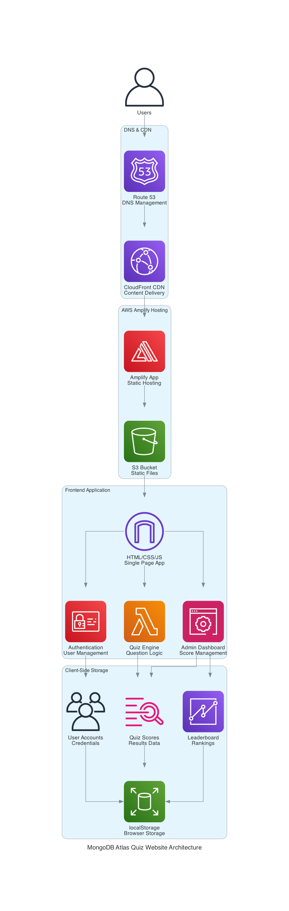

# MongoDB Atlas Quiz Website - Architecture & Implementation Guide

## 🏗️ Architecture Overview



The MongoDB Atlas Quiz Website is a serverless, client-side application built using modern web technologies and deployed on AWS Amplify. The architecture follows a simple yet effective pattern for educational quiz applications.

## 📋 Architecture Components

### 1. User Layer
- **End Users**: Students, developers, and MongoDB enthusiasts accessing the quiz
- **Admin Users**: Administrators managing quiz scores and user data

### 2. DNS & Content Delivery Network (CDN)
- **Amazon Route 53**: DNS management for custom domain routing
- **Amazon CloudFront**: Global content delivery network for fast loading times

### 3. Hosting Layer
- **AWS Amplify**: Serverless hosting platform for static web applications
- **Amazon S3**: Static file storage for HTML, CSS, JavaScript, and assets

### 4. Application Layer
- **Single Page Application (SPA)**: Pure HTML/CSS/JavaScript implementation
- **Authentication Module**: User registration and login system
- **Quiz Engine**: Question management and scoring logic
- **Admin Dashboard**: Score management and leaderboard functionality

### 5. Data Storage Layer
- **Browser localStorage**: Client-side persistent storage for:
  - User account credentials
  - Quiz scores and attempts
  - Leaderboard data
  - Session management

## 🔧 Technical Stack

| Component | Technology | Purpose |
|-----------|------------|---------|
| Frontend | HTML5, CSS3, JavaScript (ES6+) | User interface and application logic |
| Hosting | AWS Amplify | Static website hosting and deployment |
| CDN | Amazon CloudFront | Content delivery and caching |
| DNS | Amazon Route 53 | Domain management |
| Storage | Browser localStorage | Client-side data persistence |
| Authentication | Custom JavaScript | User management system |
| Styling | CSS Grid/Flexbox | Responsive design |

## 📊 Data Flow Architecture

### User Registration & Login Flow
```
User Input → Validation → localStorage → Session Management → Dashboard Access
```

### Quiz Taking Flow
```
Question Display → User Selection → Score Calculation → Results Storage → Leaderboard Update
```

### Admin Operations Flow
```
Admin Login → Verification → Score Management → Data Reset → Confirmation
```

## 🚀 Implementation Steps

### Step 1: Project Setup
```bash
# Create project directory
mkdir mongodb-quiz
cd mongodb-quiz

# Create basic file structure
touch index.html README.md
```

### Step 2: Frontend Development

#### 2.1 HTML Structure
```html
<!DOCTYPE html>
<html lang="en">
<head>
    <meta charset="UTF-8">
    <meta name="viewport" content="width=device-width, initial-scale=1.0">
    <title>MongoDB Atlas Quiz</title>
    <style>/* CSS styles */</style>
</head>
<body>
    <!-- Login Screen -->
    <!-- Registration Screen -->
    <!-- Quiz Screen -->
    <!-- Dashboard Screen -->
    <script>/* JavaScript logic */</script>
</body>
</html>
```

#### 2.2 CSS Styling
- MongoDB Atlas color scheme (#00684A, #00A86B)
- Responsive design with CSS Grid and Flexbox
- Card-based layout for different screens
- Smooth transitions and hover effects

#### 2.3 JavaScript Functionality
```javascript
// Core application state
let currentUser = null;
let currentQuestion = 0;
let score = 0;
let users = JSON.parse(localStorage.getItem('quizUsers') || '{}');
let scores = JSON.parse(localStorage.getItem('quizScores') || '{}');

// Key functions
function login() { /* Authentication logic */ }
function register() { /* User registration */ }
function startQuiz() { /* Quiz initialization */ }
function saveScore() { /* Score persistence */ }
function showDashboard() { /* Leaderboard display */ }
function resetAllScores() { /* Admin functionality */ }
```

### Step 3: Quiz Content Creation

#### 3.1 Question Database
```javascript
const questions = [
    {
        question: "What is MongoDB Atlas?",
        options: ["A local database", "A cloud database service", "A programming language", "A web framework"],
        correct: 1
    },
    // ... 9 more questions
];
```

#### 3.2 Question Categories
- MongoDB Atlas basics and features
- Deployment options and configurations
- Replica sets and sharding concepts
- Atlas-specific services (Search, Charts, Data Lake)
- MongoDB fundamentals and query language

### Step 4: AWS Amplify Deployment

#### 4.1 Create Amplify Application
```bash
# Using AWS CLI
aws amplify create-app --name mongodb-atlas-quiz --platform WEB
```

#### 4.2 Create Branch
```bash
aws amplify create-branch --app-id <APP_ID> --branch-name main
aws amplify update-branch --app-id <APP_ID> --branch-name main --stage PRODUCTION
```

#### 4.3 Deploy Application
```bash
# Create deployment package
zip -r quiz-deploy.zip index.html README.md

# Create deployment
aws amplify create-deployment --app-id <APP_ID> --branch-name main

# Upload files and start deployment
curl -X PUT "<UPLOAD_URL>" --data-binary @quiz-deploy.zip
aws amplify start-deployment --app-id <APP_ID> --branch-name main --job-id 1
```

### Step 5: Custom Domain Configuration

#### 5.1 Domain Association
```bash
aws amplify create-domain-association \
  --app-id <APP_ID> \
  --domain-name mongodbatlas.cloudopsinsights.com \
  --sub-domain-settings prefix=,branchName=main
```

#### 5.2 DNS Configuration
Add these DNS records to your domain:

**Certificate Validation (CNAME):**
```
Name: _<validation-hash>.mongodbatlas.cloudopsinsights.com
Value: _<acm-validation-hash>.jkddzztszm.acm-validations.aws.
```

**Domain Pointing (CNAME):**
```
Name: mongodbatlas.cloudopsinsights.com
Value: <cloudfront-distribution>.cloudfront.net
```

### Step 6: Testing & Validation

#### 6.1 Functional Testing
- User registration and login
- Quiz question navigation
- Score calculation accuracy
- Leaderboard updates
- Admin functionality

#### 6.2 Cross-Browser Testing
- Chrome, Firefox, Safari, Edge compatibility
- Mobile responsiveness
- localStorage functionality

#### 6.3 Performance Testing
- Page load times
- CloudFront caching effectiveness
- Mobile performance optimization

## 🔐 Security Considerations

### Client-Side Security
- Input validation and sanitization
- XSS prevention measures
- Secure password handling (client-side hashing)
- Session management best practices

### AWS Security
- HTTPS enforcement via CloudFront
- AWS Amplify security headers
- Domain validation certificates
- Access control for admin functions

## 📈 Scalability & Performance

### Performance Optimizations
- Minified CSS and JavaScript
- CloudFront global distribution
- Browser caching strategies
- Responsive image loading

### Scalability Considerations
- Serverless architecture (auto-scaling)
- Global CDN distribution
- Client-side data storage (no backend load)
- Stateless application design

## 🔧 Maintenance & Updates

### Content Updates
- Question database modifications
- UI/UX improvements
- Feature additions
- Bug fixes

### Deployment Process
1. Update local files
2. Test changes locally
3. Create new deployment package
4. Deploy via AWS Amplify
5. Verify functionality

## 📊 Monitoring & Analytics

### Available Metrics
- User registration trends
- Quiz completion rates
- Score distributions
- Popular question analysis

### AWS Amplify Metrics
- Page views and unique visitors
- Geographic distribution
- Device and browser analytics
- Performance metrics

## 🎯 Future Enhancements

### Potential Features
- Real-time multiplayer quizzes
- Question difficulty levels
- Time-based challenges
- Certificate generation
- Social sharing capabilities

### Technical Improvements
- Backend database integration
- Real-time synchronization
- Advanced analytics
- Mobile app development
- API development for third-party integrations

## 📝 Conclusion

This architecture provides a robust, scalable, and cost-effective solution for hosting educational quiz applications. The serverless approach ensures minimal operational overhead while maintaining high availability and performance.

The use of AWS Amplify, CloudFront, and Route 53 creates a production-ready hosting environment that can handle significant traffic loads while providing excellent user experience through global content delivery.
